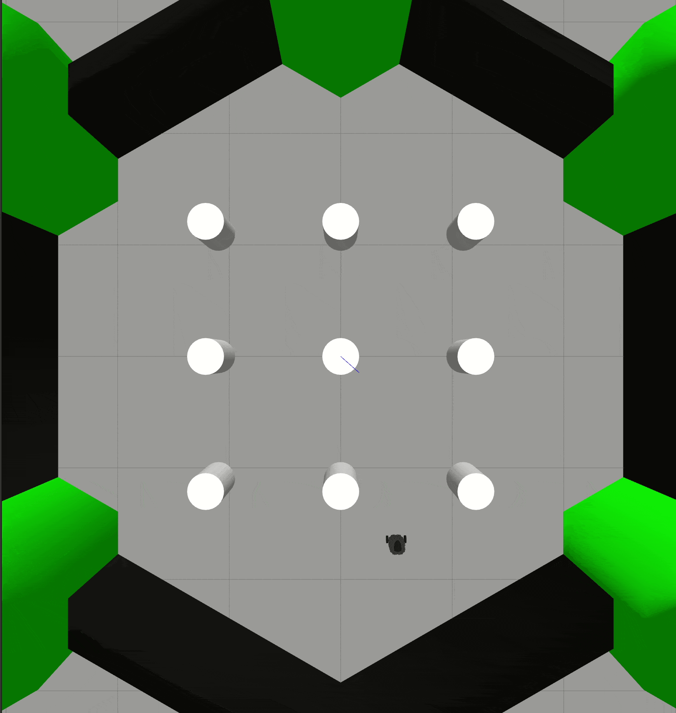
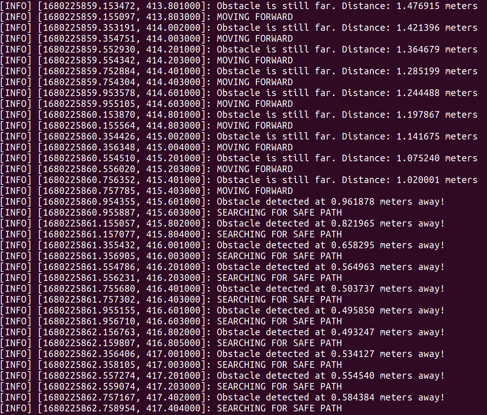

<p align="center">
  
</p>

# Robotics & Intelligent Systems: ROS Assignment 1
This repository contains the files for MCE550's first ROS assignment.

You can find a description of the MCE550 course [here](https://soe.lau.edu.lb/departments/mechatronics/degree-programs/mechatronic-courses.php#MCE550).

## Assignment Description
In this assignment, we are required to create a ROS package that contains multiple nodes, a custom message, and a launch file. The package will be used to simulate a simple robot that moves in a straight line and detects obstacles.
This assignment is an adaptation of the classical ROS publisher/subscriber tutorial. The assignment was completed using both Python and C++.

## Assignment Requirements
1. Create a new ROS package named "simple_robot" using `catkin_create_pkg`.
2. Create a new custom message type named `Obstacle` in the package. The message should have two fields: a `float32` named `distance` and a `String` named `name`.
3. Create a node named `motion_controller` in the package. This node should publish messages to the `/cmd_vel` topic to control the robot's motion. The node should subscribe to the `/obstacle_detection` topic to detect obstacles.
4. Create a node named `obstacle_detector` in the package. This node should subscribe to the `/scan` topic to detect obstacles and publish `Obstacle` messages to the `/obstacle_detection` topic.
5. Create a launch file named `robot.launch` in the package. This launch file should launch the `motion_controller` and `obstacle_detector` nodes.

The ROS package is then tested on the TurtleBot3 in simulation.

Refer to [assignment_manual.pdf](https://github.com/moudallal/mce550-robotics-assignment1/blob/master/assignment_manual.pdf) for more information regarding the assignment.

## Installation
In order to successfully run all functionalities of this assignment, you should have ROS Noetic and Gazebo 7 installed.

<i>Skip to Step 5 if you have TurtleBot3 installed along with its simulation files on your machine already.</i>

#### 1. Create a `catkin_ws/`

```sh
$ mkdir -p ~/catkin_ws/src/
$ cd ~/catkin_ws/src/
$ catkin init
```

#### 2. Install TurtleBot3

```sh
$ cd ~/catkin_ws/src
$ git clone https://github.com/ROBOTIS-GIT/turtlebot3_msgs.git
$ git clone https://github.com/ROBOTIS-GIT/turtlebot3.git
$ cd ~/catkin_ws && catkin build
```

#### 3. Change TurtleBot3 model

```sh
$ echo "export TURTLEBOT3_MODEL=burger" >> ~/.bashrc
$ source ~/.bashrc
```

#### 4. Install TurtleBot3 simulation files

```sh
$ cd ~/catkin_ws/src
$ git clone https://github.com/ROBOTIS-GIT/turtlebot3_simulations.git
$ cd ~/catkin_ws && catkin build
```

#### 5. Clone the repository inside `~/catkin_ws/src`

```sh
$ cd ~/catkin_ws/src
$ git clone https://github.com/moudallal/mce550-robotics-assignment1.git
$ cd ~/catkin_ws && catkin build
```

#### 6. Source your environment

```sh
$ cd ~/catkin_ws
$ source devel/setup.bash
```

#### 7. Grant execution rights for `.py` files

```sh
$ cd ~/catkin_ws/src/mce550-robotics-assignment1/simple_robot_py/src
$ sudo chmod +x *.py
```

## Usage
If all of the above steps were completed successfully, you can continue to use the source code you just installed.

#### 1. Launch TurtleBot3 inside Gazebo

```sh
$ cd ~/catkin_ws
$ roslaunch turtlebot3_gazebo turtlebot3_world.launch
```

#### 2. Launch the `simple_robot_***` package in a seperate terminal in Python <b>or</b> C++

```sh
$ cd ~/catkin_ws
# Python
$ roslaunch simple_robot_py robot.launch
# or C++
$ roslaunch simple_robot_cpp robot.launch
```

The `simple_robot_py` and `simple_robot_cpp` packages use the `/scan` topic from TurtleBot3 to scan for obstacles in a 10-degree range from the front side of the robot and then publish on the `/cmd_vel` topic in order to actuate the TurtleBot3.

<p align="center">
  
</p>
<p align = "center"><b>Simple Robot logging</b></p>

## Credits
- Author: Mohamad Moudallal
  - GitHub: https://github.com/moudallal
  - Email: mohamad@moudallal.xyz
