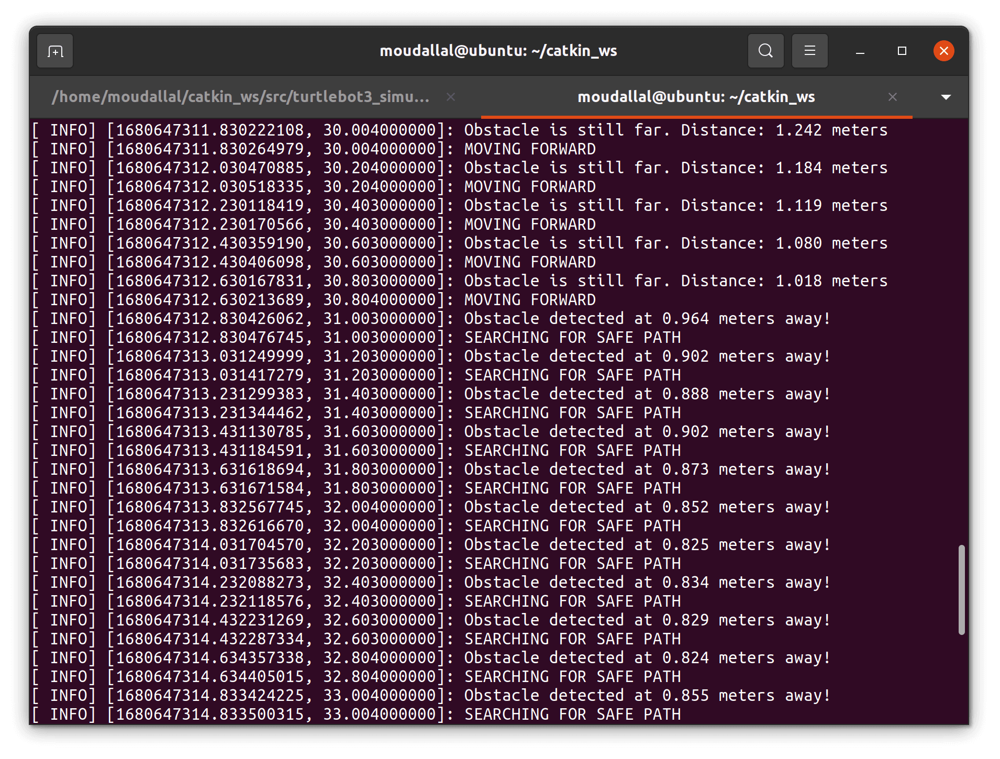

<p align="center">
  
</p>

# Robotics & Intelligent Systems: ROS Assignments
This repository contains the files for MCE550's ROS assignments. You can find a description of the MCE550 course [here](https://soe.lau.edu.lb/departments/mechatronics/degree-programs/mechatronic-courses.php#MCE550).

## Assignment Description
In assignment #1, we are required to create a ROS package that contains multiple nodes, a custom message, and a launch file. The package will be used to simulate a simple robot that moves in a straight line and detects obstacles.
This assignment is an adaptation of the classical ROS publisher/subscriber tutorial. The assignment was completed using both Python and C++.

In assignment #2, we are required to extend the work done in the first assignment and add new functionalities using ROS services. The goal is to add a wandering functionality for  simple_robot, add a service that can change the robot's velocity, and a service to make the robot chase a white ball. The assignment was completed using C++ only so far.

## Assignment Requirements
- Assignment 1
  1. Create a new ROS package named "simple_robot" using `catkin_create_pkg`.
  2. Create a new custom message type named `Obstacle` in the package. The message should have two fields: a `float32` named `distance` and a `String` named `name`.
  3. Create a node named `motion_controller` in the package. This node should publish messages to the `/cmd_vel` topic to control the robot's motion. The node should subscribe to the `/obstacle_detection` topic to detect obstacles.
  4. Create a node named `obstacle_detector` in the package. This node should subscribe to the `/scan` topic to detect obstacles and publish `Obstacle` messages to the `/obstacle_detection` topic.
  5. Create a launch file named `robot.launch` in the package. This launch file should launch the `motion_controller` and `obstacle_detector` nodes.
- Assignment 2
  1. Use the same ROS package named `simple_robot` created in Assignment 1.
  2. Instead of moving in a straight line the robot has to keep wandering any map it
  is spawned in, while avoiding obstacles.
  3. Use the laser scanner to find the direction of the clear path and navigate the robot
  along this path until the next obstacle appears.
  4. Until this point, the robot is navigating at a predetermined constant velocity.
  Create a ROS service that, when called, allows the user to change the linear and
  angular velocities at which the robot is wandering the map.
  5. Create another ROS service to allow the user to switch from the “wander” mode
  to “chase” mode. In this mode the robot needs to chase a white ball placed in the
  Gazebo environment. To make it simple, assume that the ball will be the only
  white object in the environment.

The ROS package is then tested on the TurtleBot3 in simulation.

Refer to [assignment1_manual.pdf](https://github.com/moudallal/mce550-robotics-assignment/blob/master/assignment1_manual.pdf) and [assignment2_manual.pdf](https://github.com/moudallal/mce550-robotics-assignment/blob/master/assignment2_manual.pdf) for more information regarding the assignment.

## Installation
In order to successfully run all functionalities of this assignment, you should have ROS Noetic and Gazebo 7 installed.

<i>Skip to Step 5 if you have TurtleBot3 installed along with its simulation files on your machine already.</i>

#### 1. Create a `catkin_ws/`

```sh
$ mkdir -p ~/catkin_ws/src/
$ cd ~/catkin_ws/src/
$ catkin init
```

#### 2. Install TurtleBot3

```sh
$ cd ~/catkin_ws/src
$ git clone https://github.com/ROBOTIS-GIT/turtlebot3_msgs.git
$ git clone https://github.com/ROBOTIS-GIT/turtlebot3.git
$ cd ~/catkin_ws && catkin build
```

#### 3. Change TurtleBot3 model

```sh
$ echo "export TURTLEBOT3_MODEL=waffle_pi" >> ~/.bashrc #waffle_pi has a camera included
$ source ~/.bashrc
```

#### 4. Install TurtleBot3 simulation files

```sh
$ cd ~/catkin_ws/src
$ git clone https://github.com/ROBOTIS-GIT/turtlebot3_simulations.git
$ cd ~/catkin_ws && catkin build
```

#### 5. Clone the repository inside `~/catkin_ws/src`

```sh
$ cd ~/catkin_ws/src
$ git clone https://github.com/moudallal/mce550-robotics-assignment.git
$ cd ~/catkin_ws && catkin build
```

#### 6. Source your environment

```sh
$ cd ~/catkin_ws
$ source devel/setup.bash
```

#### 7. Grant execution rights for `.py` files

```sh
$ cd ~/catkin_ws/src/mce550-robotics-assignment/simple_robot_py/src
$ sudo chmod +x *.py
```

## Usage
If all of the above steps were completed successfully, you can continue to use the source code you just installed.

#### 1. Launch TurtleBot3 inside Gazebo

```sh
$ cd ~/catkin_ws
$ roslaunch turtlebot3_gazebo turtlebot3_world.launch
```

#### 2. Launch the `simple_robot_***` package in a seperate terminal in Python <b>or</b> C++

```sh
$ cd ~/catkin_ws
# Python
$ roslaunch simple_robot_py robot.launch
# or C++
$ roslaunch simple_robot_cpp robot.launch # Only C++ package has assignment 2 functionalities
```

#### 3. [Assignment 2] Toggle between "WANDER" and "CHASE" modes

Remember to add a white ball to the Gazebo world to try out the "CHASE" functionality. You can use Gazebo's model editor to create a ball and give it a white color.

```sh
$ rosservice call /simple_robot_cpp/toggle_mode
```

#### 4. [Assignment 2] Change "WANDER" velocity

```sh
$ rosservice call /simple_robot_cpp/change_vel 0.5 0.5 # args: linear_x, angular_z
```

#### 5. [Assignment 2] Visualize camera output

```sh
$ rosrun rqt_image_view rqt_image_view
```

The `simple_robot_py` and `simple_robot_cpp` packages use the `/scan` topic from TurtleBot3 to scan for obstacles in a 14-degree range from the front side of the robot and then publish on the `/cmd_vel` topic in order to actuate the TurtleBot3.

`simple_robot_cpp` also uses the `ToggleMode.srv` service on `/simple_robot_cpp/toggle_mode` to to toggle between "CHASE" and "WANDER" mode, and the `DriveVelocity.srv` as a reusable service on both `/simple_robot_cpp/change_vel` and `/simple_robot_cpp/chase` to set the robot's velocities. `simple_robot_cpp` subscribes to `/camera/rgb/image_raw` in order to fetch camera data and analyze it.

<p align="center">
  
</p>
<p align = "center"><b>Simple Robot logging</b></p>
<br />
<p align="center">
  
</p>
<p align = "center"><b>Simple Robot chasing the white ball</b></p>

## Credits
- Author: Mohamad Moudallal
  - GitHub: https://github.com/moudallal
  - Email: mohamad@moudallal.xyz
